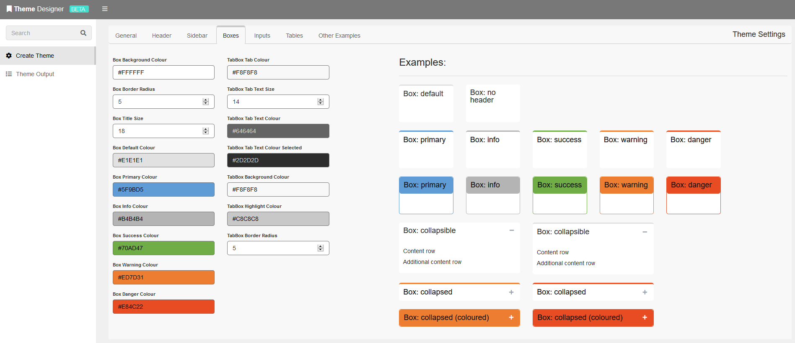

# dashboardThemeDesigner
<a href="https://nik01010.wordpress.com/" target="_blank">Blog</a> | <a href="https://nik01010.wordpress.com/contact/" target="_blank">Contact</a>
 

Live shinydashboard theme designer, using the <a href="https://github.com/nik01010/dashboardthemes" target="_blank">dashboardthemes</a> package.

### Note:
- This user interface is still in experimental status.
- Not all parameters of dashboardthemes are available in the GUI - several have been hard-coded but these can be changed manually in the resulting theme object.
